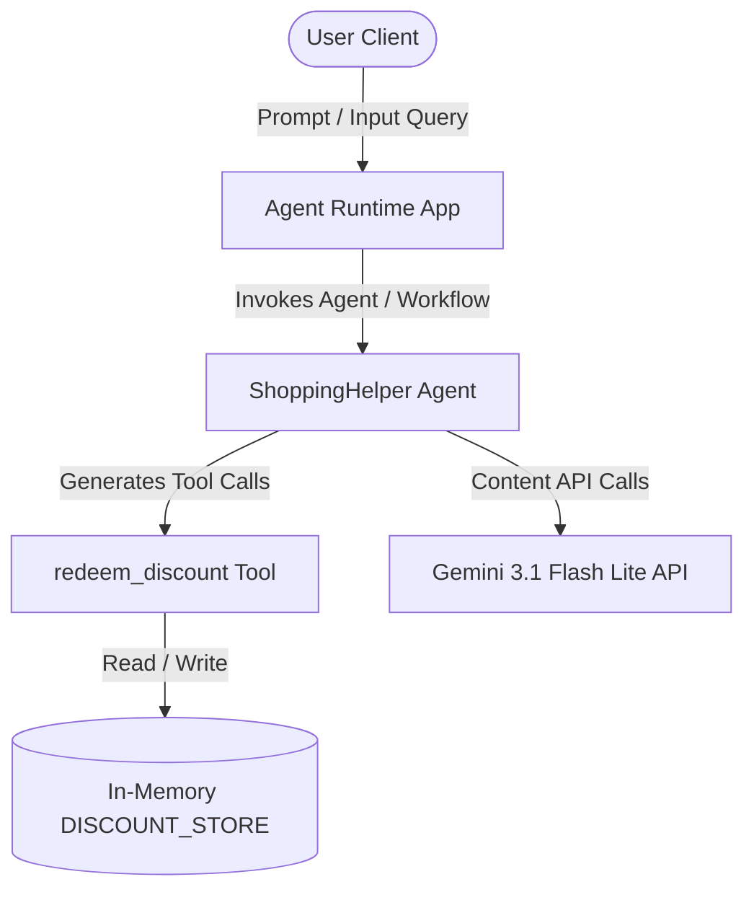

# STRIDE Threat Model Assessment: Shopping Assistant Agent

This document provides a systematic STRIDE threat modeling assessment of the `shopping-assistant` codebase and architecture, focusing on the agent graph, workflows, tools, and configurations.

---

## 1. System Boundaries & Data Flow Map

The `shopping-assistant` is a ReAct-based agent built on the Google ADK framework.

*   **Entry Points**: User queries sent to `AgentEngineApp.async_stream_query()` and routed through `shopping_assistant_workflow`.
*   **Trust Boundaries**:
    *   Boundary between the external User Client and the Agent App.
    *   Boundary between the LLM Agent (non-deterministic) and the python tool logic (deterministic).
*   **Data Storage**: In-memory `DISCOUNT_STORE` dictionary simulating a database.

---

## 2. STRIDE Threat Assessment

### 1. Spoofing (S)
*   **Threat**: A user can impersonate a registered user to redeem discount codes they are not authorized to use.
*   **Assessment**: The `redeem_discount` tool accepts `user_id` as a parameter from the agent workflow. If the system does not cryptographically sign or verify the session's active user at the trust boundary, the LLM agent (or a user via prompt injection) could spoof the `user_id` (e.g. "Redeem WELCOME50 for user_admin").
*   **Severity**: **High**
*   **Mitigation**: Restructure the tool to resolve the `user_id` directly from secure session context (e.g., via ADK context) rather than accepting it as an LLM-supplied argument.

### 2. Tampering (T)
*   **Threat**: Manipulation of the `DISCOUNT_STORE` state or parameters.
*   **Assessment**:
    *   `DISCOUNT_STORE` is stored as an in-memory dictionary. It lacks transactional safety, database locks, or concurrency isolation. Under concurrent requests, two threads could redeem the same code simultaneously (Race Condition / Double Redemption).
    *   Users can manipulate parameters (`code`, `user_id`) via direct prompt injection.
*   **Severity**: **Medium**
*   **Mitigation**: Migrate `DISCOUNT_STORE` to a transactional database (e.g., PostgreSQL or Firestore) and use transactions/pessimistic locking to prevent double redemption.

### 3. Repudiation (R)
*   **Threat**: A user denies performing a discount redemption, or a malicious action is logged under another user's identity.
*   **Assessment**: Because `user_id` is not authenticated or validated securely (it's passed as a plain parameter), logs captured via `logger.log_struct()` reflect the spoofable parameters.
*   **Severity**: **Medium**
*   **Mitigation**: Bind audit logs to verified session metadata authenticated at the API gateway layer rather than relying on agent-injected parameters.

### 4. Information Disclosure (I)
*   **Threat**: Leakage of API tokens, system keys, or proprietary internal prompts and structures.
*   **Assessment**:
    *   *Resolved Vulnerability*: The initial codebase hardcoded the API key prefix/mock key (`AIzaSyD-mock-key-value-12345`), triggering Semgrep warnings.
    *   *Uncaught Exceptions*: Raw stack traces from the `google.genai` SDK or Python errors could bubble up to the user response if errors in the agent run loop are not caught cleanly.
*   **Severity**: **Medium**
*   **Mitigation**: Ensure strict error boundaries inside the runtime app to sanitize stack traces and return generic errors to the client.

### 5. Denial of Service (D)
*   **Threat**: Quota exhaustion or high API bills caused by request flooding.
*   **Assessment**: The agent uses Gemini API calls (`gemini-3.1-flash-lite`). Since there are no rate limits configured on the `async_stream_query` endpoint, a malicious user could flood the app, leading to denial of service for other users due to quota exhaustion.
*   **Severity**: **High**
*   **Mitigation**: Implement rate limiting (e.g., token bucket) at the API routing/App gateway level.

### 6. Elevation of Privilege (E)
*   **Threat**: Guest/unauthenticated users executing registered-only actions.
*   **Assessment**: The `redeem_discount` tool checks `if not user_id or user_id.startswith("guest_")`. This check is easily bypassed if the caller supplies any string not starting with `"guest_"` (e.g., `user_id="123"`).
*   **Severity**: **High**
*   **Mitigation**: Verify authentication tokens and resolve the user profile securely on the backend before calling the agent.

---

## 3. Summary of Security Recommendations

| Pillar | Threat Description | Severity | Recommended Fix |
| :--- | :--- | :--- | :--- |
| **Spoofing** | User identity spoofing via prompt parameter manipulation | High | Resolve `user_id` from secure ADK context instead of accepting it as an LLM argument. |
| **Tampering** | Concurrency race condition / double-redemption | Medium | Use a transactional database with locking to manage coupon states. |
| **Repudiation** | Audit logs contain spoofable parameters | Medium | Log verified authentication session data, not agent-supplied arguments. |
| **Information Disclosure** | Leakage of stack traces and API keys | Medium | Implement error sanitation boundaries; keep API keys in secret manager. |
| **Denial of Service** | Resource/quota exhaustion | High | Apply rate-limiting at the application gateway level. |
| **Elevation of Privilege** | Bypass of guest detection check | High | Validate caller authentication state on the backend. |
